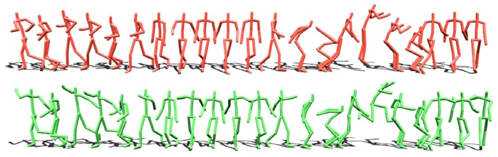

Hmm Publications: The Whole Works in Human Motion Modeling Laboratory
============
This project is created to display the works of the Human Motion Modeling Lab at Institute of Computing Technology, Chinese Academy of Sciences. The Lab is hosted by Prof. <a href="https://people.ucas.ac.cn/~xiashihong?language=en">Shihong Xia</a>. This project includes published works in the lab, including 3D human motion modeling, face modeling, and their applications. 

------------
**TVCG 2023** 
**Pose-aware Attention Network for Flexible Motion Retargeting by Body Part** 

<a href="https://hlcdyy.github.io/">Lei Hu</a>, 
<a href="http://zihaozhang.tech/">Zihao Zhang</a>, 
<a Chongyang Zhong</a>,
<a Boyuan Jiang</a>,
<a href="https://people.ucas.ac.cn/~xiashihong?language=en">Shihong Xia</a>, 
IEEE Transactions on Visualization and Computer Graphics, DOI: 10.1109/TVCG.2023.3277918

------------

Motion retargeting is a fundamental problem in computer graphics and computer vision. Existing approaches usually have many strict requirements, such as the source-target skeletons needing to have the same number of joints or share the same topology. To tackle this problem, we note that skeletons with different structure may have some common body parts despite the differences in joint numbers. Following this observation, we propose a novel, flexible motion retargeting framework. The key idea of our method is to regard the body part as the basic retargeting unit rather than directly retargeting the whole body motion. To enhance the spatial modeling capability of the motion encoder, we introduce a pose-aware attention network (PAN) in the motion encoding phase. The PAN is pose-aware since it can dynamically predict the joint weights within each body part based on the input pose, and then construct a shared latent space for each body part by feature pooling. Extensive experiments show that our approach can generate better motion retargeting results both qualitatively and quantitatively than state-of-the-art methods. Moreover, we also show that our framework can generate reasonable results even for a more challenging retargeting scenario, like retargeting between bipedal and quadrupedal skeletons because of the body part retargeting strategy and PAN.

-
<a href="https://www.youtube.com/watch?v=oTAcxTtPXUg&t=95s&ab_channel=HMM_LAB">Video</a>
-
<a href="https://ieeexplore.ieee.org/document/10129844">Paper</a> 
-
<a href="https://github.com/hlcdyy/pan-motion-retargeting">Code & Demo</a>
-

------------
**ACM Transactions on Graphics (SIGGRAPH), 2015** 
**Realtime Style Transfer for Unlabeled Heterogeneous Human Motion** 

<a href="https://people.ucas.ac.cn/~xiashihong?language=en">Shihong Xia</a>, 
<a Congyi Wang </a>, 
<a Jinxiang Chai </a>,
<a href="https://www.cs.cmu.edu/~jkh/">Jessica Hodgins</a>,
ACM Transactions on Graphics, Volume 34, Issue 4, 27 July 2015, Article No.: 119, pp 1–10, https://doi.org/10.1145/2766999

------------

This paper presents a novel solution for realtime generation of stylistic human motion that automatically transforms unlabeled, heterogeneous motion data into new styles. The key idea of our approach is an online learning algorithm that automatically constructs a series of local mixtures of autoregressive models (MAR) to capture the complex relationships between styles of motion. We construct local MAR models on the fly by searching for the closest examples of each input pose in the database. Once the model parameters are estimated from the training data, the model adapts the current pose with simple linear transformations. In addition, we introduce an efficient local regression model to predict the timings of synthesized poses in the output style. We demonstrate the power of our approach by transferring stylistic human motion for a wide variety of actions, including walking, running, punching, kicking, jumping and transitions between those behaviors. Our method achieves superior performance in a comparison against alternative methods. We have also performed experiments to evaluate the generalization ability of our data-driven model as well as the key components of our system.

-
<a href="https://youtu.be/EBzUyr5FsrA">Fast Forward Video</a>
-
<a href="https://youtu.be/-c9nqPYtOlg">Video</a> 
-
<a href="Media/Siggraph_2015_style/paper.pdf">Paper</a>
-
<a href="https://drive.google.com/file/d/1TiE5moEtX_PR0ELkLGo-0y6k13YwlIUa/view?usp=sharing">Dataset</a>
-

